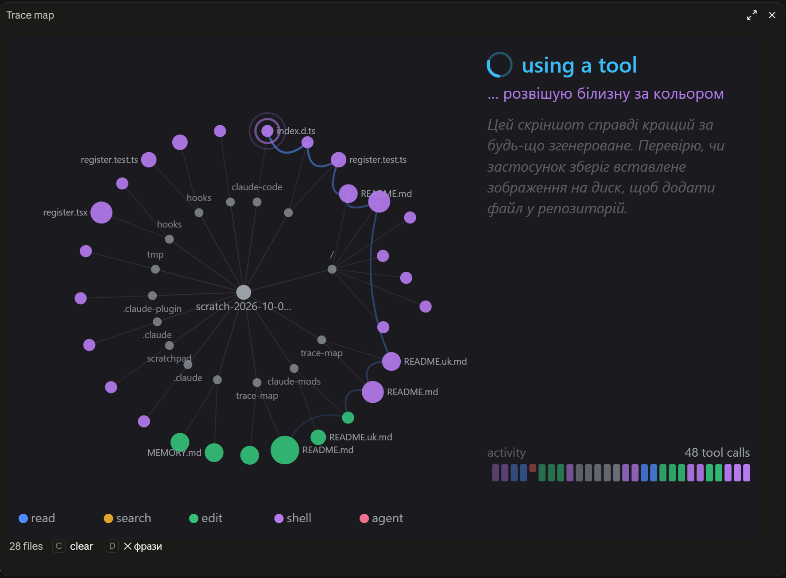

# trace-map

Мод для Claude Code: панель поруч із транскриптом, яка в реальному часі малює, що Claude робить під час ходу. Зроблений для скрінкастів: глядач бачить не стіну логів, а карту.

[English](README.md) · **Українська**



*Панель під час роботи Claude над цим репозиторієм: виклик shell, замаскований під хатню справу, праворуч потік думок, ліворуч карта файлів, унизу смуга активності.*

## Що малює

Одне SVG-зображення, перемальовується на кожну подію. Зверху вниз:

- **Кільце фази** і підпис: `idle` (сіре), `thinking` (жовте, дуга крутиться), `using a tool` (блакитне), `answered` (зелена точка).
- **Рядок дії**: знак статусу (`…` працює, `✓` добре, `✗` помилка), фраза в кольорі інструмента і дрібна підказка (назва файлу або патерн). За умовчанням фраза — побутова справа українською замість сирої команди: `✓ пришиваю ґудзик, відірваний втретє  login.ts`. Для кожного виду виклику свій набір фраз: пошук, читання, правка, запис, shell, видалення, збірка, git, commit, push, pull, тести, нотатка, субагент, web.
- **Потік думок**: останні рядки міркувань моделі сірим курсивом, поки вона думає.
- **Карта файлів**: у центрі проєкт, на внутрішньому кільці теки (тека з пошуком — пунктирне бурштинове коло), на зовнішньому файли; точка росте з кожним дотиком, колір від останнього інструмента; між файлами, зачепленими поспіль, сині дуги маршруту.
- **Смуга активності**: одна риска на виклик інструмента, в його кольорі; помилка — коротша червона. Поруч лічильник `N tool calls`.
- **Легенда**: `read` синій, `search` бурштиновий, `edit` зелений, `shell` фіолетовий, `agent` рожевий.
- **Рядок під картинкою**: `N files`, кнопка `clear`, кнопка `✕ фрази` / `✓ фрази`.

У терміналі замість SVG малюється текстовий список. Панель відкривається сама на старті сесії.

## Команди

| Команда | Дія |
| :- | :- |
| `/trace-map` | Відкрити панель |
| `/trace-map honest` | Показувати інструмент і суть виклику замість фраз |
| `/trace-map disguise` | Повернути фрази |
| `/trace-map log` | Хронологія сесії: ходи і виклики, що показувала фраза і що вона приховувала |
| `/trace-map log last` | Те саме лише для останнього ходу |

Вибір фраз зберігається. Його ж можна змінити в `/plugin` → **Installed** → `trace-map` → **Configure options** (опція **Disguise the last tool**) або в рядку `trace-map.disguise` у `/config`.

## Установка

```text
/plugin marketplace add ivangithubed/claude-mods
/plugin install trace-map@learningtogether-mods
```

З оболонки:

```bash
claude plugin marketplace add ivangithubed/claude-mods
claude plugin install trace-map@learningtogether-mods
```

У відкритій сесії після цього `/reload-plugins`. Перевірка: `/plugin` показує `1 mod active · trace-map`.

Потрібен Claude Code 2.1.287+ у терміналі або Claude Desktop від 2.1.286. Панель малюється в терміналі й у вкладці Code застосунку Claude Desktop; у VS Code, `claude -p` і хмарних сесіях хуки працюють, але нічого не малюється.

## Ширина панелі

Картинка підлаштовується під ширину панелі, але рядок дії з фразою читається повністю не за будь-якої ширини. Проста перевірка: рядок на кшталт `✓ пришиваю ґудзик, відірваний втретє  login.ts` має стояти в один рядок, без `…` у кінці.

| Ширина панелі | Розкладка | Що видно |
| :- | :- | :- |
| менше ~57 колонок (~440 px) | все одне під одним | фраза обрізана |
| ~60–79 колонок (~470–620 px) | все одне під одним | фраза повністю, підказка з назвою файлу може зникати |
| **~80–91 колонка (~620–710 px)** | все одне під одним | **фраза й підказка повністю: рекомендовано для вузької панелі** |
| ~92–149 колонок (~720–1180 px) | карта ліворуч, текст праворуч | права колонка вузька, фраза скорочується |
| **від ~150 колонок (~1180 px)** | карта ліворуч, текст праворуч | **усе повністю: рекомендовано для широкої панелі** |

Пікселі приблизні: мод рахує 8 px на колонку. Для запису екрана найкраще або вузька панель на 80–91 колонку, або широка від 150.

## Що мод читає і чого не робить

Мод працює всередині Claude Code з вашими правами, тому ось чесний перелік.

**Читає, поки сесія йде:**

- параметри кожного виклику інструмента: шляхи файлів для `Read`/`Edit`/`Write`/`NotebookEdit`, патерн і теку для `Grep`/`Glob`, перший рядок команди для `Bash`/`PowerShell` (з нього ж вибирає токени, схожі на імена файлів), опис для `Agent`;
- текст міркувань моделі (`thinking`) у міру того, як він надходить, лише для головного агента; у пам'яті тримаються останні 600 символів;
- робочу теку сесії, її id, тему з `/config`;
- текст вашого промпта на початку кожного ходу: перші 60 символів ідуть у лог.

**Зберігає:** стан карти (файли, маршрут, лічильники) і лог для `/trace-map log` у сховищі плагінів Claude Code (`$.store`) під ключем своєї сесії, щоб пережити `/reload-plugins`. Лог — до 400 рядків: час і перші 60 символів промпта на початку ходу, а для кожного виклику час, тривалість, фраза і перші 60 символів суті (шлях, патерн або команда). Ключ сесії видаляється, коли сесія закінчується. Окремо зберігається вибір «фрази/чесно».

**Не робить:**

- не ходить у мережу, не викликає модель, не запускає процесів;
- не читає і не пише файлів на диску (жоден із `calls:` нижче не є файловим чи мережевим);
- не змінює виклики інструментів, промпти чи дозволи: кожен хук передає подію далі без змін.

Повний перелік подій і викликів API — те, що друкує `claude plugin validate` для цієї теки:

```text
Validating plugin manifest: .../plugins/trace-map/.claude-plugin/plugin.json

Validating hooks: .../plugins/trace-map/hooks/hooks.json

  ❯ ./register.tsx hooks: session.start, session.end, config.set{key=theme}, command.run{command=trace-map}, turn.start, turn.complete, turn.step, tool.call, ui.render{component=Pane, requestId=trace-map}
  ❯ ./register.tsx calls: $.command.register, $.config.list (via readTheme), $.config.set (via setDisguise), $.session.id, $.store.delete, $.store.get, $.store.set (via changed, setDisguise), $.ui.invalidate, $.ui.open, $.ui.resolve

✔ Validation passed
```

## Розробка

```bash
claude plugin validate ./plugins/trace-map
claude plugin test ./plugins/trace-map
```

Тестів 14, у `hooks/register.test.ts`. Файли:

```text
.claude-plugin/plugin.json   маніфест, опція userConfig `disguise`
hooks/hooks.json             вказує на модуль хуків
hooks/register.tsx           хуки та малювання
hooks/disguise.ts            фрази-маскування і класифікація викликів
hooks/register.test.ts       тести
types/index.d.ts             спільні типи
docs/                        бриф для звукового дизайну, зразок логу
```

Теку `.claude-plugin/types/` (типи API модів) генерує сам Claude Code; вона в `.gitignore`.

## Версії

- **0.2.0** — фрази-маскування українською за видом виклику, кнопка і `/trace-map honest|disguise|log`, потік думок у панелі, збереження стану через reload.
- **0.1.0** — перша версія: кільце фази, рядок інструмента, радіальна карта файлів, смуга активності.

## Ліцензія

[MIT](../../LICENSE) © 2026 learningtogetherua
